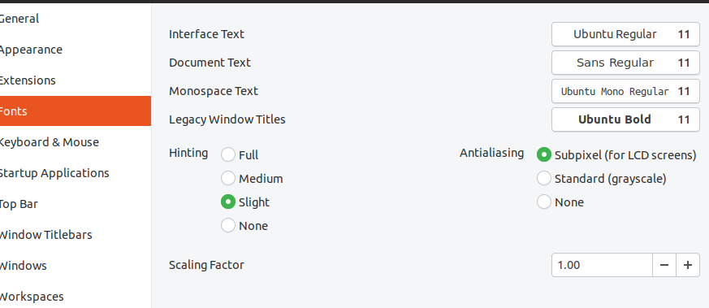
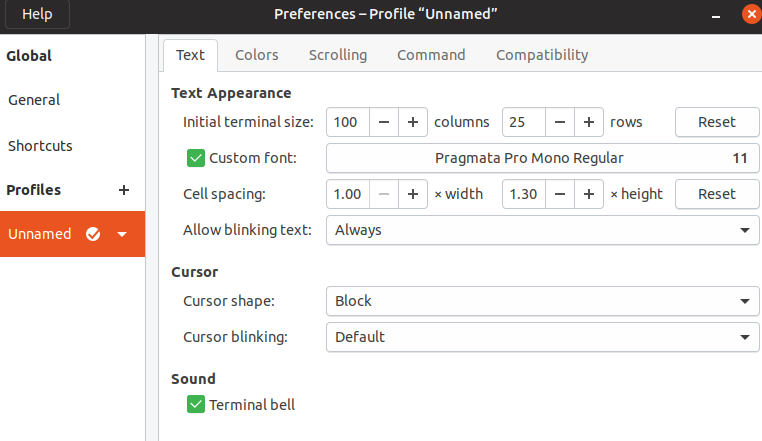
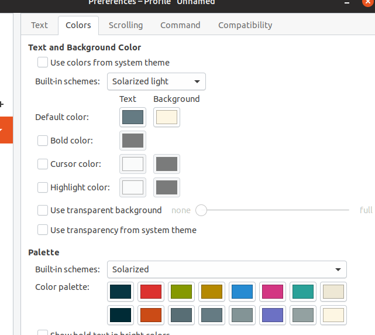

# Ubuntu Backup Plan

Whenever I format the PC and I re-install Ubuntu, this happens...

## VsCode Extensions

- Flutter/Dart
- Angular 8
- bibtexLanguage
- C/C++
- Arduino ?
- Java Extension Pack
- Dracula Theme
- Maven for Java
- Material Icon Theme
- Pandoc Citer
- Parchment Theme
- Python
- Quokka.js
- Scheme
- Spring Boot Tools
- Sunrise
- Visual Studio IntelliCode (maybe installed by java pack?)
- vscode-icons
- vscode-pandoc

## Vim Configuration

Make the following folders inside `~/.vim`: `backup`, `bundle`, `colors`, `swap`, and `undo` (autoload is implicit from Pathogen). Plus, you need to install the following plugins including Pathogen:

- NerdTREE
- Fireplace
- Airline
- Surround
- Ctrl-P
- Ale
- vim-airline-themes
- Typescript

## .bashrc notable code

```bash
PATH=$PATH:~/.npm-global/bin
PATH=$PATH:/opt/android-studio/bin/
PATH=$PATH:/opt/flutter/bin/

alias herokupg='heroku pg:psql postgresql-tetrahedral-50242 --app blackbriar'
```

## Dock software so far

Icon size of 40 pixels.

1. Explorer
2. Settings (Tweaks)
3. Screenshot
4. Transmission
5. PCSXR
6. Spotify
7. Libre Docs
8. Libre Calc
9. Typora
10. GIMP
11. OBS Studio
12. Audacity
13. Thunderbird
14- Chrome
15. Slack
16. Postman
17. VsCode
18. DOSBox
19. Terminal

## Tweaks and Settings








# Windows 10 Backup Plan

...
