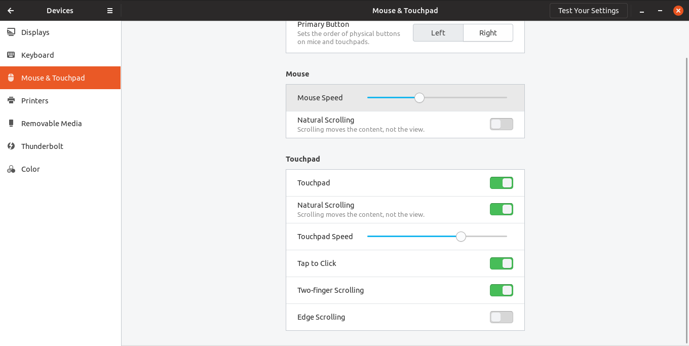
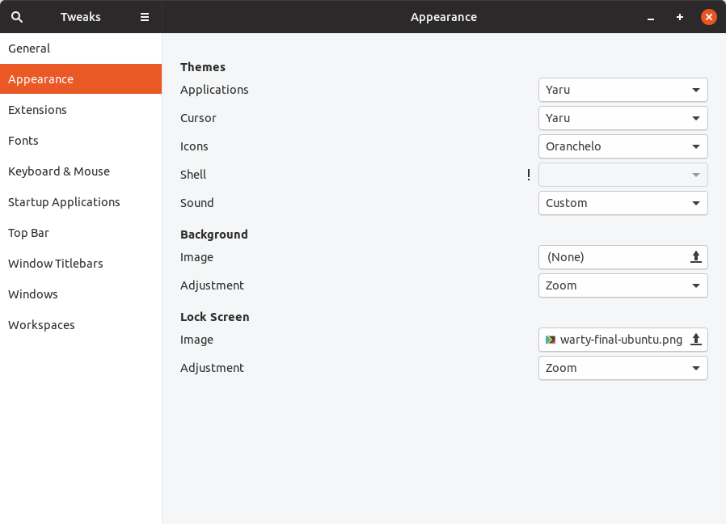
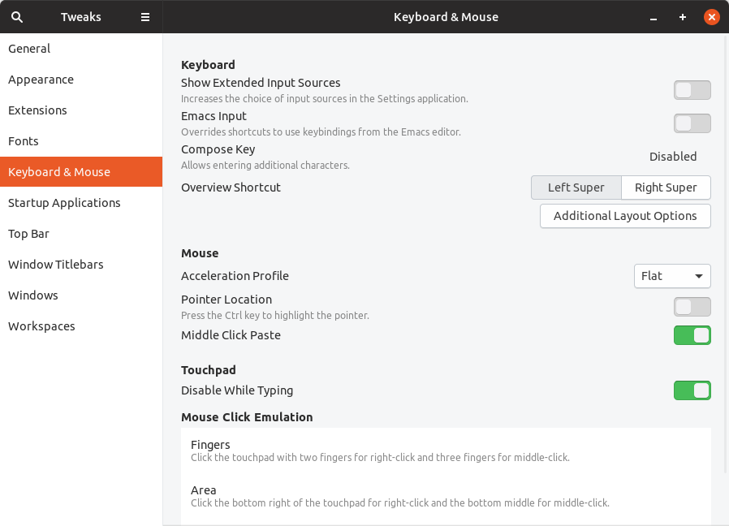
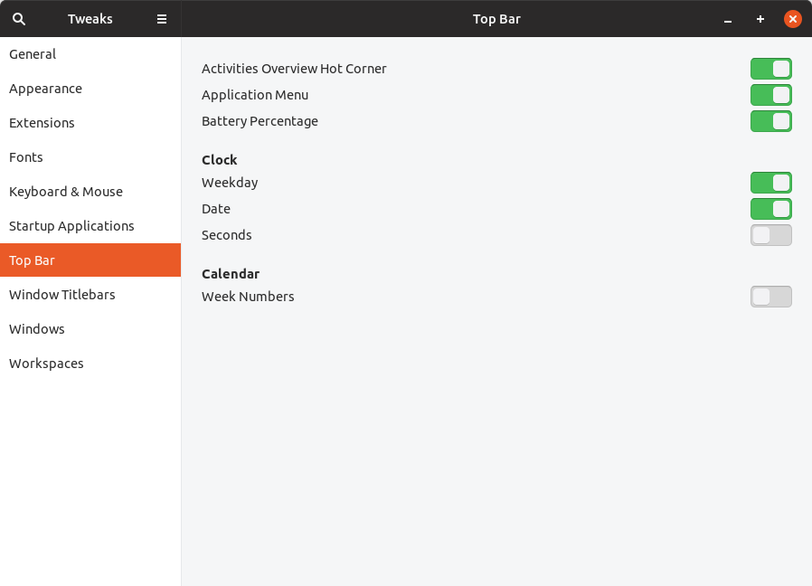

# Ubuntu Backup Plan

## VsCode Extensions

- Angular 8 Snippets
- Haskell
- Material Icon Theme
- Parchment Theme
- Python
- Arduino
- C/C++
- Scheme
- vscode-icons
- Löve 2D Support
- Lua
- Elixir

## Vim Configuration

Make the following folders inside `~/.vim`: `backup`, `bundle`, `colors`, `swap`, and `undo` (autoload is implicit from Pathogen). Plus, you need to install the following plugins including Pathogen:

- NerdTREE
- Fireplace
- Airline
- Surround
- Ctrl-P
- Ale
- vim-airline-themes
- Typescript

## Dock software so far

1- Explorer
2- Settings (Tweaks)
3- Screenshot
4- Font Manager
5- Spotify
6- Transmission
7- Libre Office (W, X, I)
8- Thunderbird
9- DBeaver
10- Slack
11- Chrome
12- Firefox
13- IntelliJ IDEA
14- VSCode
15- DosBOX
16- Terminal

## Tweaks and Settings

