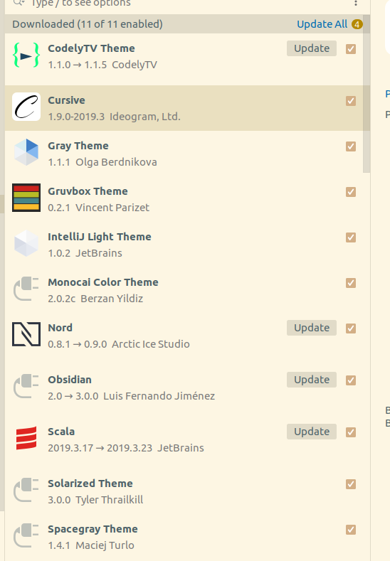
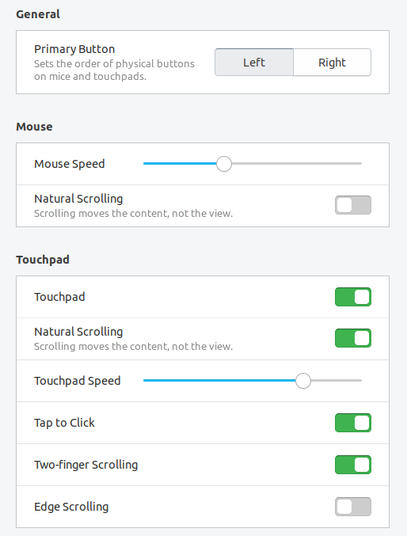
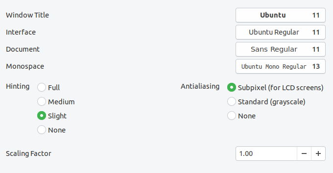
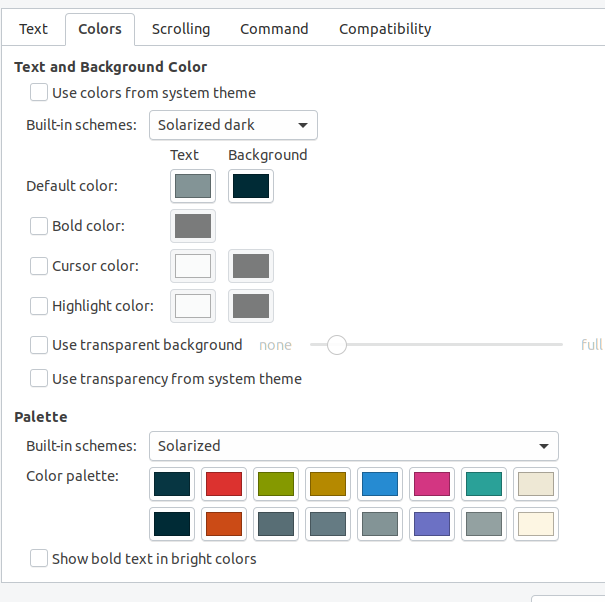
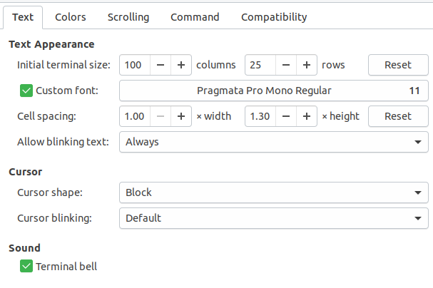

# Ubuntu Backup Plan

Whenever I format the PC and I re-install Ubuntu, this happens...

## VsCode Extensions

- Angular 8 Snippets
- C/C++
- C#
- Dractula IntelliJ Theme
- Java Pack
- Eclipse Color Theme
- elm
- Gruvbox Minor
- Haskell Syntax
- Material Icon Theme
- Maven for Java
- Monokai Pro
- Parchment Theme
- Python
- Scheme
- Spring Boot Tools
- Sunrise
- TODO Highlight
- Todo Tree
- Visual Studio IntelliCode
- XML
- Arduino [?]

## Vim Configuration

Make the following folders inside `~/.vim`: `backup`, `bundle`, `colors`, `swap`, and `undo` (autoload is implicit from Pathogen). Plus, you need to install the following plugins including Pathogen:

- NerdTREE
- Fireplace
- Airline
- Surround
- Ctrl-P
- Ale
- vim-airline-themes
- Typescript

## .bashrc notable code

```bash
PATH=$PATH:~/.npm-global/bin
PATH=$PATH:/opt/android-studio/bin/
PATH=$PATH:/opt/flutter/bin/

PATH=$PATH:~/.npm-global/bin
alias herokupg='heroku pg:psql postgresql-tetrahedral-50242 --app blackbriar'

export GEM_HOME=~/.ruby/
export PATH="$PATH:~/.ruby/bin"
export JAVA_HOME=/usr/lib/jvm/java-11-oracle

SPARK_HOME=/usr/local/spark
export PATH=$SPARK_HOME/bin:$PATH
```

## Dock software so far

Icon size of 40 pixels.

1. Explorer
2. Settings/Tweaks
3. Screenshot
4. Transit
5. Popcorn Time
6. Steam
7. Spotify
9. Excel
10. Typora
11. Thunderbird
12. Chrome
14. GIMP
15. Audacity
16. OBS
17. Slack
18. Postman
19. VSCode
20. Terminal
21. IntelliJ
22. Android Studio
23. Inkscape
24. Anki
25. TeamViewer

## Tweaks and Settings

- **Dock Icon Size**: 40
- **Input Volume**: A tad bit above 7 bars












## Neovim's CoC List of Plugins

- coc-snippets
- coc-eslint
- coc-emmet
- coc-diagnostic
- coc-conjure
- coc-vimtex
- coc-tsserver
- coc-python
- coc-json
- coc-java
- coc-css
